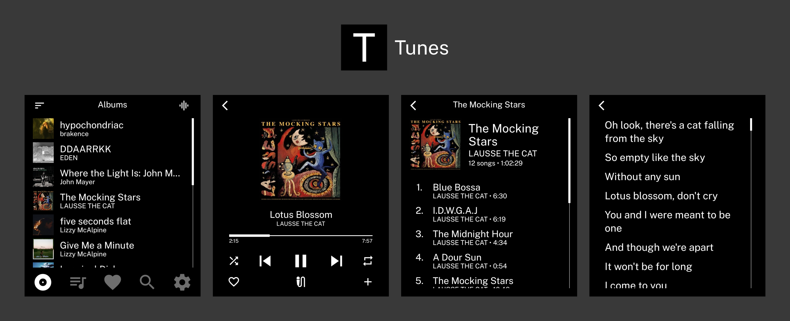

A music player for the Light Phone III.

## Installation

The latest APK is available in [Releases](https://github.com/vandamd/reverb/releases/latest).

I recommend using [Obtainium](https://github.com/ImranR98/Obtainium) and adding the repository URL to receive updates automatically.

## Getting Started

Reverb requires you to upload your own music files. You need to create a new directory called `Reverb` in the `Music` directory.

In other words, put your music in `/storage/emulated/0/Music/Reverb`!

For those with `adb` and usb debugging enabled, I have created [Reverb Manager](https://github.com/vandamd/reverb-manager) to easily upload files.

## Features

- High resolution playback
- Liked songs
- Playlists
- Lyrics (uses [lrclib.net](https://lrclib.net))
- Seamless song transitions

## Support

Reverb is developed and maintained in my free time.

If you find it useful, please [consider sponsoring](https://github.com/sponsors/vandamd). :)
